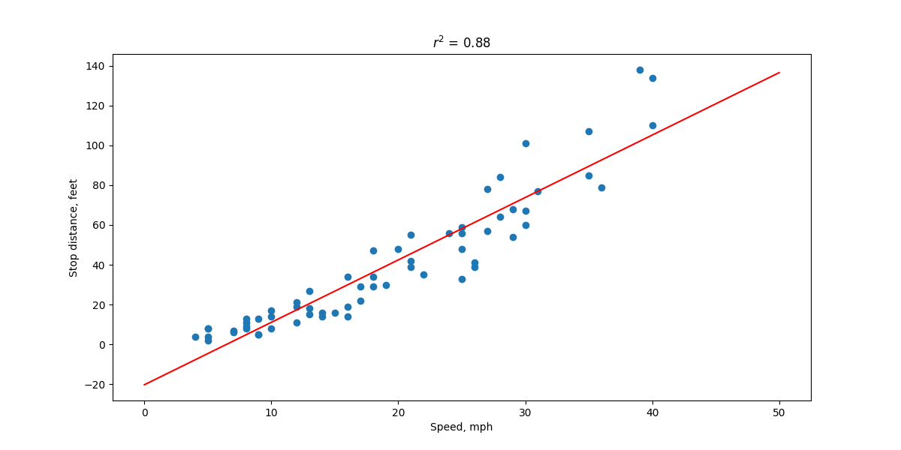

## A large $$r^2$$ value does not imply that the estimated regression line fits the data well.

The American Automobile Association has published data (Defensive Driving: Managing Time and Space, 1991) that looks at the relationship between the average stopping distance ( y = distance, in feet) and the speed of a car (x = speed, in miles per hour). The data set carstopping.txt contains 63 such data points.

1. Use Minitab to create a fitted line plot of the data. (See Minitab Help Section - Creating a fitted line plot). Does a line do a good job of describing the trend in the data?
2. Interpret the $$r^2$$ value. Does car speed explain a large portion of the variability in the average stopping distance? That is, is the $$r^2$$
 value large?
3. Summarize how the title of this section is appropriate.

## Solution

1. Not very, because at speed 0 mph our prediction will be as -20 feets for stop distance. And at the high speed distance tends to increase non lineary.
2. The coefficient of determination is high, but it is because of not very big dataset. Actually line is not very well fit data.
3. High coefficient doesn't mean well fit.