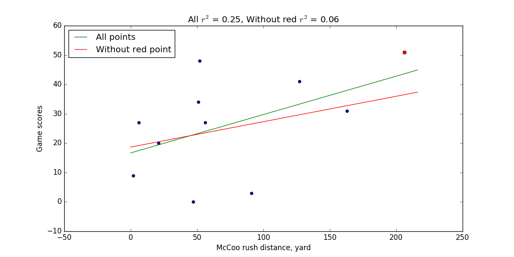

## One data point can greatly affect the $r^2$ value

The mccoo.txt data set contains data on the running back Eric McCoo's rushing yards (mccoo) for each game of the 1998 Penn State football season. It also contains Penn State's final score (score).

1. Use Minitab to create a fitted line plot. Interpret the $r^2$ value, and note its size.
2. Remove the one data point in which McCoo ran 206 yards. Then, create another fitted line plot on the reduced data set. Interpret the $r^2$ value. Upon removing the one data point, what happened to the $r^2$ value?
3. When a correlation coefficient is reported in research journals, there often is not an accompanying scatter plot. Summarize why reported correlation values should be accompanied with either the scatter plot of the data or a description of the scatter plot.

## Solution

1. It has a low value. It means that 25% of variance in runned distance "explains" the variance in scores.
2. $r^2$ value greatly decreased, but line almost doesn't changed.
3. Because $r^2$ score doesn't enough to get full understanding and deriving is line a good model for this task. And actually coefficient value can vary and depends on data and it is hard to believe and iterpret this coefficients without any plot.